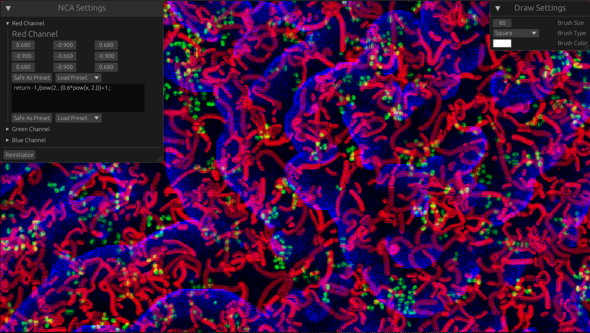

# NCA-Playground
A playground to experiment with neural cellular automata. EPILEPSY WARNING: This application may potentially trigger seizures for people with photosensitive epilepsy. User discretion is advised.

The application runs a compute shader to run a neural cellular automaton in each color channel.
The user can change the parameters of the automaton via a simple UI. These are the entries of a 3x3-filter as well as an activation function (as WGSL code) for each color channel. Additonally, it is possible to draw on screen with different brush sizes, shapes and colors. Presets for filters and activation functions can be loaded and saved.

## What is a neural cellular automaton?
Neural cellular automata, first popularized by the image processing community to grow images, generalize the idea of cellular automata. Instead of binary values, each cell of the grid contains a real number and the update step consist of computing the convolution with a real valued filter matrix and applying an activation function to the result in each cell.